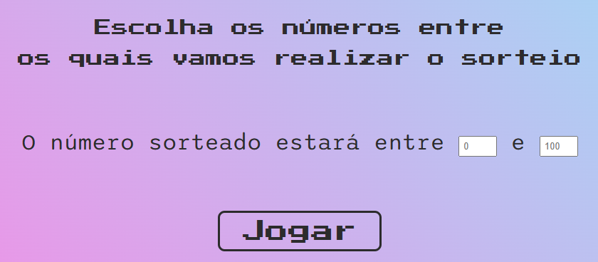
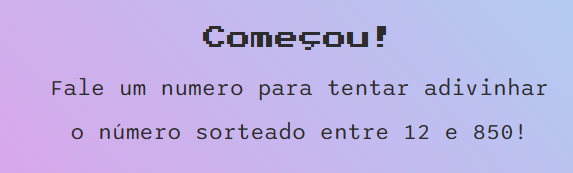
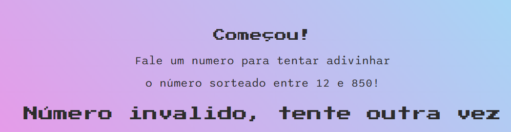
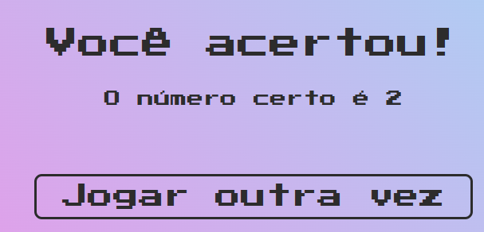

# Jogo de adivinhação por comando de voz


  


----
## Conteúdo

[Sobre o Jogo](#sobre-o-jogo) 

[Web Speech API](#web-speech-api)

[Link do jogo](https://adivinhe-o-numero-speech-recognition.vercel.app/)


---

## Sobre o jogo
<br>

Este projeto foi desenvolvido para estudar o uso da [Api Web Speech](https://developer.mozilla.org/en-US/docs/Web/API/Web_Speech_API). Para isso, desenvolvemos um 'jogo de advinhação, onde usamos a voz para 'chutar' o número que foi sorteado. Iniciamos o jogo selecionando o 'range' numerico de onde vamos realizar o sorteio:



O jogo só inicia quando o jogador apertar 'JOGAR'. Esse botão está associado a um evento de _submit_ que ao mesmo tempo sorteia o número que deverá ser advinhado e inicia o reconhecimento de voz. O codigo responsável por isso é:

### Função do Sorteio:
```javascript
function sorteio(min, max){
    min = Math.ceil(min);
    max = Math.floor(max)
   return Math.floor(Math.random() * (max-min + 1) + min)
}
```

### Inicio do reconhecimento de voz:
```javascript
botaoInciar.addEventListener('submit', () =>{
    recognition.start();
    recognition.addEventListener('result', onSpeak);
})
```
Quando o jogador inicia o jogo, a seguinte mensagem aparece:



Dessa forma, avisamos que o jogo começou e lembramos constantemente o intervalo no qual se encontra o número sorteado.

Os números falados pelo jogador são convertidos de string para inteiros para, assim, facilitar a validação. Caso o jogador diga algo que não pode ser convertido para inteiro (Qualquer palavra que não seja um número, inteiro ou não), a seguinte mensagem surge na tela:



Caso o jogador fale um número fora do 'range' determinado por ele mesmo no inicio do jogo, a seguinte texto é impresso na tela:


Enquanto o jogador não conseguir acertar, o jogo fornecerá dicas para aproximar o jogador da resposta correta. Para isso, usamos um pequeno codigo de validação que imprime na tela uma mensagem especifica para cada possibilidade (o número ser maior ou menor que a tentativa do jogador)

### Função que imprime o chute e a dica:
```javascript
function exibirChute(chute, frase, sentido){
    selecao.innerHTML = `
    <h3>Você disse:</h3>
    <div  class="caixa">
        <p data-chute>${chute}</p>
    </div>
    <p data-mensagem class="mensagemtexto">${frase} <i class="fa-sharp fa-solid fa-arrow-${sentido}"></i> <br> Tente outra vez...</p>`;
}
```

### Função de validação:
```javascript
function verificaValor(chute){

    chute = parseInt(chute)

    if(Number.isNaN(chute)){
        selecao.innerHTML = `<h3>Número invalido, tente outra vez</h3>`
    } else if(chute < minNum || chute > maxNum){
        selecao.innerHTML = `<h3>Sua tentativa deve estar entre ${minNum} e ${maxNum}</h3>`
    } else if(chute < numeroSorteado){
        exibirChute(chute, "O múmero é maior que seu chute", "up")
    } else if (chute > numeroSorteado){
        exibirChute(chute, "O múmero é menor que seu chute", "down")
    } else {
        exibirVitoria(chute)
    }
}
```

Caso o jogador acerte o chute e adivinhe o número sorteado, o código imprime na tela a seguinte mensagem, contendo um botão que permite o jogador reiniciar o jogo:



A qualquer momento o jogador pode encerrar o jogo e recarregar a tela inicial falando a palavra 'SAIR'.

[Voltar para o topo](#jogo-de-adivinhação-por-comando-de-voz)

---

## Web Speech API

Apesar de possuir uma implementação simples, existem algumas particularidades encontradas na implementação da API de reconhecimento de voz que merecem a mensão.

A primeira e mais simples é a compatibilidade. Apesar de bastante abrangente, a API ainda não é suportada por um dos principais browsers do mercado: O Firefox. 

Por tanto, usamos o Window.navigator para validar o browser utilizado e assim avisar o jogador se existe a possibilidade de incompatibilidade.

### Validação do navegador:
```javascript
const browserName = getBrowserName(navigator.userAgent);

if(browserName == 'Microsoft Edge (Chromium)' || browserName == 'Google Chrome or Chromium' || browserName == 'Apple Safari'){

} else {
    alert('Seu Browser pode não suporta o reconhecimento de voz, o que impossibilitará o jogo. Sugerimos usar navegadores com base em chromium')
}
``` 
Além disso, durante os testes, nos deparamos com uma peculiaridade dentro da função _parseInt_: Ela não se mostrou capaz de transformar em inteiro nem o numero **zero** nem o **um**. 

Para contornar esse problema, utilizamos outro validador, que se encontra dentro da função responsável pela captação da string obtida pelo reconhecimento de voz:

### Codigo construido para contornar o problema do parseInt:
```javascript
function onSpeak(e){
    
    let chuteNum = e.results[0][0].transcript;

    let chute = chuteNum;

    if (chute == 'Sair.'){
        window.location.reload();
    } else if(chute == 'Um.'){
        chute = 1;
        verificaValor(chute);
    } else if (chute == 'Zero.'){
        chute = 0;
        verificaValor(chute);
    } else {
        verificaValor(chute);
    }

};
```

[Voltar para o topo](#jogo-de-adivinhação-por-comando-de-voz)

---

Desenvolvido por Carlos Sammartin 

[](https://github.com/Primatasan)
[](https://www.behance.net/carlosmsdesig) [](https://www.linkedin.com/in/carlossanmartindeabreu/) 


